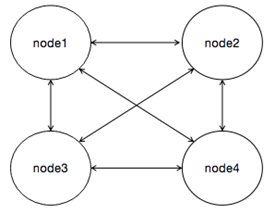
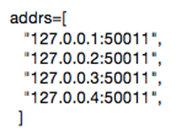
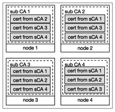

安全机制
========

当前区块链安全架构图主要可以分为五部分，分别是数据安全、网络安全、共识安全、合约安全。数据安全主要是指区块链数据存储的安全，包括隐私数据保护等方面；网络安全是指区块链网络的安全，包括通信和网络组建过程中节点准入和请求的权限控制等内容；共识安全是指共识算法本身的安全性；合约安全是指合约代码执行环境的安全和合约本身设计的安全。

|image0|

密码学算法
---------

目前平台支持国际标准（standard）和国密标准（gm）两种密码体系。采用可插拔的多级加密机制对于业务完整生命周期所涉及的数据、通信传输、物理连接等都进行了不同策略的加密，保障系统的安全性。

1. 哈希算法

哈希是一种散列函数，把任意长度的输入通过哈希算法，变换成固定长度的输出（哈希值），哈希值的空间通常远小于输入的空间，并且哈希函数具有不可逆性，根据哈希值无法反推输入原文的内容。

哈希算法在平台中有着广泛运用，例如交易的摘要、合约的地址、用户地址等都运用了哈希算法。平台提供了可拔插的、不同安全级别的哈希算法选项。安全等级由低到高分别有SHA2-256、SHA3-256、SHA2-512、SHA3-512等，同时平台也支持相应的国密哈希算法SM3。这些哈希算法都可以保证为消息生成体积可控、不可逆推的数字指纹，保证平台的数据安全。

2. 交易签名

为了防止交易被篡改，平台采用成熟的椭圆曲线数字签名算法（Elliptic Curve Digital Signature Algorithm，简称ECDSA）对交易进行签名，保证平台的身份安全。同时也支持基于椭圆曲线密码的国密标准算法SM2。

平台使用了secp256k1曲线、secp256r1曲线（SM2则使用国家密码标准推荐参数）实现了数字签名算法，可供用户自行选择后对平台交易进行签名验签，保证交易的正确性以及完整性。同时平台支持该算法对节点间消息进行签名验证，保证节点间消息通信的完整性以及正确性。

3. 密钥协商

在网络通信过程中，使用会话密钥对传输的信息进行加密，可以防止黑客窃听机密消息进行欺诈等行为。平台通过实现椭圆曲线Diffie-Hellman（ECDH）密钥协商协议完成会话密钥的建立和网络中用户之间的相互认证，同时支持国家密码标准的密钥协商算法SM2，保证通信双方可以在不安全的公共媒体上创建共享的机密协议，而不必事先交换任何私有信息。

密钥协商在身份认证和交易安全中都具有重要的作用，通过密钥协商建立起的安全通信信道能够实现安全的信息交换，保证了平台的通信安全。以安全身份认证为前提建立的密钥协商安全信道，首先能够确认通信双方的身份合法，再次，通过对称加密能够大大提高通信效率，因为并不需要每次通信都去认证身份，信道就能够确定通信双方的身份。

4. 基于对称加密的密文传输

平台在通信双方协商出一个机密共享密钥后，再基于对称加密算法保证节点间的密文传输，使得计算上破解传输内容的难度更高，从而保证平台消息传输的高安全性。

对称加密也称常规加密，私钥、或者单钥加密，一个完整的对称加密方案由五个部分组成：

-	明文（plaintext）：原始的消息或者数据，作为算法输入；
-	加密算法（encryption algorithm）：加密算法对明文进行各种替换和转换；
-	秘密密钥（secret key）：算法输入，算法进行替换和转换都依赖于秘密密钥。
-	密文（ciphertext）：已被打乱的消息，作为加密算法的输出，取决于明文和秘密密钥。对于一个给定的消息，两个不同的秘密密钥会产成不同的密文。
-	解密算法（decryption algorithm）：本质上是加密算法的逆运算。使用密文和秘密密钥产生原始明文。

平台支持AES（Advanced Encryption Standard）算法，即高级加密标准，该算法是一个基于排列和置换运算、迭代的、对称密钥分组的密码。它可以使用128、192 和 256 位密钥，并且用 128 位（16字节）分组加密和解密数据。同时也支持国家密码标准的对称加密算法SM4。

5. 传输层安全

除了上述提到的密钥协商与密文传输以外，平台节点间还通过传输层安全TLS（Transport Layer Security）来保证通信安全。TLS 能够在传输层保障信息传输的安全性，是目前较为通用的网络传输实施标准，在几乎所有的网络安全传输中都采用了该技术，如google、淘宝、百度、微信等。

身份认证/准入机制
----------------

平台使用CA证书体系进行联盟成员的准入控制。主要分为集中式CA认证体系、分布式CA认证体系两种方式。

1. 中心化CA

中心化CA认证体系可以由可信机构提供，也可通过自建CA体系实现。平台已通过集成CFCA（China Financial Certification Authority）实现数字证书管理功能，适用于对于证书系统安全性与权威性有较高要求的银行或金融机构；自建CA体系需要建设独立的PKI／CA系统，并且建立完整的运营管理体系。

|image1|

2. 分布式CA

分布式CA体系认证管理是将证书管理权限由中心机构移到联盟链各参与方，联盟网络节点互相颁发准入证书给其他网络节点，在建立连接阶段完成证书认证。分布式CA治理具有去中心、自动化、高效等优点。

|image2|

**CA证书说明**

- RootCA ：RootCA（Root Certificate Authority）为根证书颁发机构，代表PKI体系中的信任锚。
- ECA ：ECA（Enrollment Certificate Authority）为准入证书颁发机构，该机构能够向下颁发节点准入证书ECert。
- RCA ：RCA（Role Certificate Authority）为角色证书认证机构，该机构有权限颁发RCert（Role Certificate）。
- Ecert ：ECert（Enrollment Certificate）节点准入证书，持有ECert的节点才能够同Hyperchain链上服务交互，否则无法加入相应的Namespace。
- Rcert ：RCert主要是用于区分区块链节点中的验证节点和非验证节点，拥有RCert才被认为是区块链中的验证节点，参与区块链节点之间的共识。RCert和TCert一样只能作为身份证明的证书存在，不能向下颁发证书。
- Tcert ：Tcert (Transaction Cert)为交易证书，不同于其他几类证书需要部署前线下签发，TCert是节点在运行中使用ECert自动签发的。TCert 用于实现伪匿名交易，在发起交易的时候需要使用TCert相匹配的私钥对交易进行加密，TCert可通过API接口向节点申请，并由节点签发，每一条Transaction可以用一个新的TCert进行签名，可以实现每条交易的相对匿名，但是可以由签发方审查。这里需注意的是向A节点申请的TCert只能用于和A节点间的通信。
- SDKCert ：SDKCert 为平台SDK的准入证书，标识SDK的合法性，非法的SDK将无法向节点发出请求。
- TLSCert ：TLSCert(Transport Layer Security Cert) 为安全传输层协议证书。TlsCert 用于传输层安全协议证书，即在传输网络传输过程中需要验证传输层安全协议证书的安全性，验证通过即可以进行正常网络通信，反之则无法进行网络通信。

中心化CA认证体系
^^^^^^^^^^^^^^^

准入控制体系主要分为两种，一个是节点的准入控制，主要限制新节点的加入，保证联盟区块链中的节点都是联盟成员合法拥有的；另一个是接口的准入控制，也就是限制未授权的客户端或者开发工具通过接口连接区块链节点，限制DDoS攻击，减少恶意请求对节点运算能力和资源的侵占。针对平台使用证书来限制接口的使用，进行接口的准入控制，只有拥有合法证书的SDK才能链接制定的节点，下面主要说明针对节点的准入控制。

联盟区块链一般来说节点数较少，所以平台采用最为健壮而且直观的全连接P2P网络，任意两个共识节点之间都需要建立双向链接，节点间的准入控制就是在初始节点启动时，或者新节点加入时进行节点握手和身份确认，控制每一条[n(n-1)/2] 条连接能否成功握手。

|image3|

N个节点的网络中，每个节点都要和另外n-1个节点建立链接，拥有n(n-1)/2条双向双工连接。为了建立起这样的链接，每个节点中都需要事先配置好另外n-1个节点的IP地址和开放端口。

|image4|

节点之间通过证书进行身份验证的逻辑与传统证书验证逻辑一致，这里不展开描述。

分布式ca认证体系
^^^^^^^^^^^^^^^

在联盟区块链背景下，将准入控制交由某个可信第三方管理，或者是由联盟区块链网络中的某个参与方管理，都不能完全满足一些特殊的使用场景的要求，比如有时候就要求节点完全的平等并且不能有第三方机构的介入。因此这种情况下，中心化的准入控制就存在至少两个缺点，首先是控制过于集中，而存在单点故障，其次是权力过于集中，而导致威胁其他参与方的安全，因此平台设计了分布式的准入控制体系的设计，即分布式CA认证体系。

分布式CA将CA功能分散到各个子CA（sub CA）中，每个节点都给其他节点签发证书也接受其他节点的证书。以节点1为例，它包含了其他三个节点签发的证书，但是要注意这三个节点证书对应同一个私钥，因此节点一只有一个私钥。注意，当新节点加入时，其节点证书是自动配置的，但初始节点的证书需要手动配置并放在配置文件中指定的位置。

|image5|

硬件安全
--------

平台为了保证平台的安全性，采用软硬一体化的设计，将平台软件与硬件相结合。软件集合即为平台软件主体，负责区块链网络账户交易等正常操作；硬件部分为硬件密码卡、密码钥匙（广州江南科友科技股份有限公司研发的型号为SJK1862-G 的PCIE密码卡和提供给用户保管自身私钥的SJK1905智能密码钥匙）、TEE可信执行环境，负责随机数生成、密钥存储、账本数据加密等操作。

.. |image0| image:: ../../images/security1.tif
.. |image1| image:: ../../images/security2.tif
.. |image2| image:: ../../images/security3.tif

