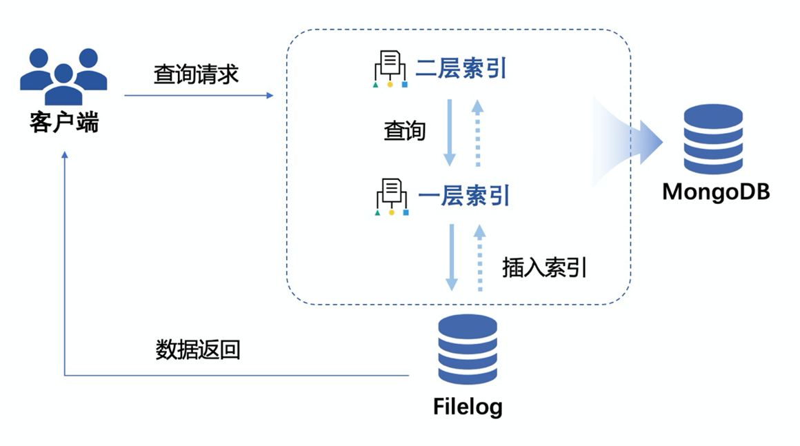

数据管理
========

数据归档
--------

随着区块链运行时间的增长，区块链系统存储的数据容量将高速增长，且数据的增长的速度甚至会超过存储介质容量增长的速度，从而限制区块链技术的发展。为此，平台实现了区块链数据归档，在不停机的情况下，将一部分线上数据迁移到线下存储。以此解决在有限存储空间下区块链数据的存储问题。平台也提供归档数据浏览器（详见3.6.3 Archive-reader浏览器），支持用户查阅归档数据。平台也实现了归档数据恢复的功能，在不影响链上正常工作的情况下，支持运维人员将线下存储的数据恢复至线上。

数据归档针对的主体是区块数据，同时包括区块对应的日志数据、索引数据、交易回执数据。平台支持用户自定义归档范围，用户可以直接指定一个已经被提交的区块号作为参数，创世区块到入参区块的数据将被归档至线下。另外，考虑到直接归档的流程较为耗时，直接归档的请求返回和归档流程将异步进行，用户可通过查询归档结果的接口查询归档是否成功。数据归档功能支持各节点自主定义归档范围，节点间无需同步归档。

|image0|

合约数据可视化
-------------

区块链平台为了维护合约数据的隐私性，所有部署在Hyperchain平台上的智能合约，其底层数据都采用复杂的编码方式进行编码，使得区块链节点即使拥有了全量的区块链数据，也无法获得合约数据的明文信息。

为此，Hyperchain提供了一种合约数据可视化组件Radar，能自动捕获合约状态数据的变更并进行解析，并最终将最新明文数据后导出到关系型数据库（mysql）中，方便用户进行数据处理分析。Radar具有完善的故障恢复机制，同时支持结构型以及文档型数据格式的导出。

Radar的整体流程如下图所示：

1.	用户通过发送jsonRPC命令的方式通知radar监听某个合约；
2.	每一笔调用该合约的交易，其调用信息都会被发送给radar存储；
3.	提交区块阶段，平台将所有数据的更新记录和最新数据发送给radar；
4.	radar根据监听时解析出的合约信息、交易的调用信息，以及最后发送过来的数据解析出合约中状态变量的最新值，并导出到mysql中。

|image1|

数据索引
-------

数据查询是区块链应用中最普遍的场景，但由于区块链独特的账本结构，一直以来都缺少一种高效安全的查询手段。

区块链底层的账本数据以Key-Value键值对模型进行存储，目前只能提供基于key 的精确检索，而在实际应用场景存在更广泛的基于value（业务数据）的检索需求。比如在商品溯源场景中，我们可能要通过商品ID来检索出整个商品流通过程中的交易，这时往往通过遍历区块检索的方式；或是将商品ID到交易哈希的映射关系存储在智能合约中，但随着数据量增大会合约会遇到性能瓶颈，导致检索效率低下。

为了解决上述问题，平台依托于底层索引数据库，采用可插拔的MongoDB存储引擎，提取关键信息存储到索引数据库中，再将自定义的业务索引信息（如商品ID等）与关键信息进行映射,实现基于业务数据的快速索引功能，为上层应用提供更高效的查询服务。

索引数据库由一层索引和二层索引组成：一层索引是业务数据索引；二层索引是在一层索引数据的基础上创建的数据库索引，能进一步提高查询效率。比如数据非常多，通过商品ID查交易的请求延时很高，这时候就需要创建二层索引来提高查询效率。用户可根据实际需求选择开启或关闭一层索引及二层索引。

|image2|

大文件可信存储
-------------

中心化的大文件存储存在成本高、易篡改、单点故障等问题，而区块链因其可信任、安全不可篡改、冗余备份、多方协作等特性在数据可信存储方面具有天然的优势，但目前区块链碍于技术瓶颈对于商业化大文件存储存在成本高、容量小、性能差等问题，具体表现在：

-	大数据量导致系统性能下降。目前的区块链技术架构，大文件、大数据量的文本文件信息每个节点全量直接存储会导致系统性能明显下降，必须要有足够大的存储空间支持，无法满足商业场景对系统性能的需求，并且存在存储空间浪费。
-	随着数据量的日益庞大，系统的存储和查询性能受到影响，对系统的高可用，扩展性也有较高的要求，需要支持大文件的高效查询。

为此，平台通过自研文件分离存储模型，实现了大文件的可信存储、安全共享与高效查询。目前在保证系统性能和稳定性不受影响的情况下，能支持GB级别图片、音视频等非结构化数据的上链存储，同时允许用户按需存储文件，避免全节点存储，有效降低成本并增强可用性。

大文件存储在节点指定的存储系统中；区块链上存储文件相关的信息，包括但不限于文件索引、文件名、文件哈希、文件创建时间、文件大小、文件位置。

|image3|

可信数据源服务
-------------

在中国人民银行发布的《区块链能做什么？不能做什么？》的报告中，预言机定义如下：区块链外信息写入区块链内的机制，一般被成为预言机。区块链是一个确定性的、封闭式的系统，为了满足区块链分布式一致性结果的要求，智能合约的运行必须要保持一致确定的结果，所以无法主动获取链外非确定性数据来源，如Web天气服务、航班动态信息、随机数等。但是在真实的商业场景中，有很多业务需求都需要调取外部数据，如保险赔付、商品溯源等自动化场景。预言机作为区块链和外部世界的桥梁，通过可信计算技术以及建立信任的约束机制，让区块链系统打破了封闭，使区块链主动获取外部数据成为现实。

Oracle预言机可以从外部引入世界状态的信息，包括URL数据、搜索引擎以及跨链数据等。我们通过引入Oracle可信数据源，可以将区块链外的数据源接入区块链中，执行更复杂的业务逻辑，支持更加丰富的的业务场景。

Oracle预言机实现的重点主要在数据源、数据传输、数据处理三个方面：

-	数据源：作为区块链上与外部世界沟通的桥梁，数据源可以多种多样，包括：随机数、Web数据、通用或者特定API或服务、文件等等。
-	数据传输：保证数据传输安全，预言机获取外部数据时通过类TLS传输层安全协议保证数据真实可靠不被篡改；预言机再通过私钥签名将处理完的数据发送到Oracle合约。
-	数据处理：在数据/获取或者数据处理过程中通过TEE可信执行环境来保证程序服务的公平公正，不篡改窜。

|image4|

Oracle预言机服务流程主要分为4个步骤：

1.	用户合约调用Oracle合约接口，发送申请数据请求；
2.	Oracle合约执行用户合约请求，调用外部预言机服务（用户如果想使用预言机服务，必须要部署专门的Oracle智能合约，用于和外界数据的交互）；
3.	预言机服务收到Oracle合约事件请求，将去外部调取数据源，将请求到的数据源返回给Oracle合约，预言机服务运行在TEE中保证安全性；
4.	Oracle合约最终返回用户合约最初的请求数据。

消息订阅服务
-----------

Hyperchain作为一个“共享状态”的区块链实现，其运转通过不断的状态变迁实现。每一次状态变迁，都会产生相应的一系列事件作为本次状态变迁的标志。因而，为了方便外部业务系统捕获、监听区块链的状态变化，我们提供了一组统一的消息订阅的接口，作为智能合约与外界通信的消息通道。

平台的消息订阅功能基于MQ（消息队列）实现。MQ是一种添加了保存消息的容器的通信方法，服务端和客户端通过读写出入队列的消息来通信，无需直接互连。同时，MQ提供的异常情况恢复机制避免了连接断开导致消息丢失的问题。

平台MQ服务需要用户独立于平台启动一个RabbitMQ服务器，并将其所在的服务器称为RabbitMQ-broker。平台提供的MQ服务相当于一个生产者客户端，负责将平台消息推送到RabbitMQ-broker；消息的消费者作为一个消费者客户端，与RabbitMQ-broker建立连接，等待从RabbitMQ-broker推送出来的消息。

MQ服务的具体使用方法如下：

1.	用户通过SDK向平台注册自己的消息队列queue，指明queue需要的路由键RoutingKey集合；平台会创建队列同时启动服务，将queue的名称与交换机Exchanger名称返回给用户；
2.	用户正常使用平台发送交易，当有RoutingKey相应的事件产生时，消息会被MQ服务自动推送至RabbitMQ-broker；
3.	用户可通过主动查询或被动推送的方法获得订阅的信息。

	外部通过消息订阅系统，可以监听到以下几种类型的事件：

-	区块事件：每产生新的区块都将主动向订阅者推送最新区块信息；
-	合约事件：合约相关的事件触发（比如合约上账户余额变动）将会向订阅者推送消息；
-	交易事件：写入区块的交易的交易体与交易回执都会主动推送给订阅者；
-	系统异常事件：当平台有异常抛出或者系统状态改变的时候，便会向订阅者主动推送消息。

.. |image0| image:: ../../images/data1.tif
.. |image1| image:: ../../images/data2.tif

.. |image3| image:: ../../images/data4.tif
.. |image4| image:: ../../images/data5.tif
