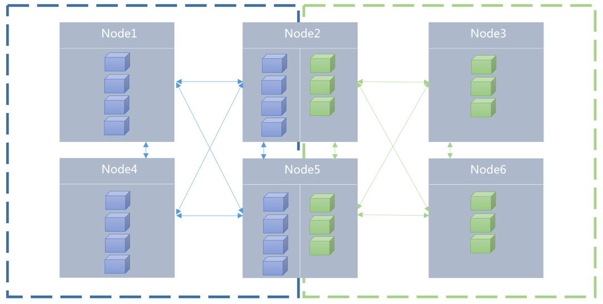
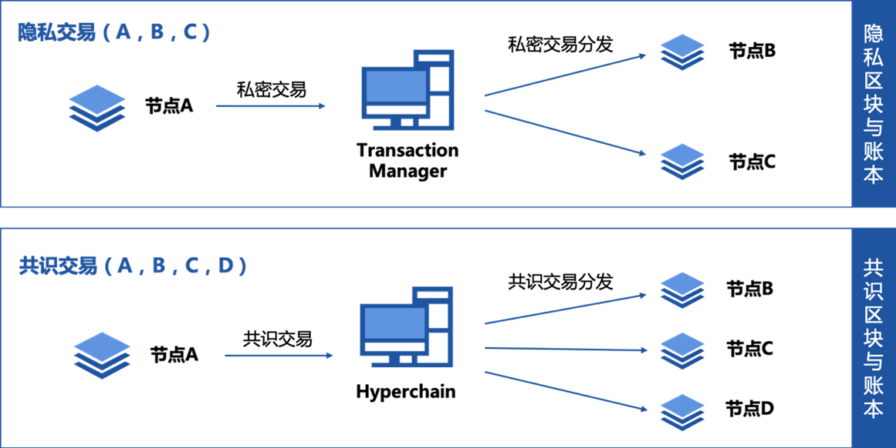

隐私保护
=======

区块链公开透明的特性在实际商用场景落地过程中往往限制了业务的扩展，为了应对实际场景中隐私保护的需求，平台提供分区共识、隐私交易以及TEE账本加密三种隐私保护方案。

分区共识
-------

平台通过设计Namespace（名字空间）机制实现区块链网络内部交易的分区共识。使用者可以按照名字空间进行业务交易划分，类似于分组的概念，隐私数据通过建立一个私密的分区，在该分区进行共享和存储，通过分区之间独立和隔离的方式达到隐私保护的效果。

|image0|

在用户使用该功能时，首先需要在配置文件中确定填写想要加入的分区名称，用户可以按照其业务需求可以选择参与一个或者多个namespace。如图所示，Node1、2、4、5组成namespace1，而Node2、3、5、6组成namespace2。其中Node1仅参与了namespace1，而Node2则同时参与了两个名字空间，名字空间中通过CA认证方式控制节点的动态加入和退出，这部分与第3.1.2小节准入机制一致。

隐私交易
-------

平台支持交易粒度的隐私保护，在发送交易时指定该笔交易的相关方，该交易明细只在相关方存储，而隐私交易的哈希在全网共识后存储在公共账本，既保证了隐私数据的有效隔离，又可验证该隐私交易的真实性，实现了交易的可验不可见。

用户在使用隐私交易功能时，需要首先发起隐私交易，指定相关方，相关方即为发送隐私交易的对象；平台解收到这笔交易后会解析该交易，判断是否为隐私交易，如果是隐私交易将该笔交易同步给相关参与方；同步成功后再发起一笔包含该隐私交易哈希的共识交易；执行共识交易和隐私交易，共识交易在公共账本中存储，隐私交易只在相关方的私有账本存储。

|image1|

TEE账本加密
----------

账本加密针对用户的账户信息和业务数据进行按需加密操作，将密钥存储在TEE硬件可信执行环境中，账本数据通过TEE的密钥进行加解密，由于在整个过程中账本加密的密钥都在TEE中而没有向外暴露，所以可以保证账本数据加密的安全性；而且平台会确保硬件执行环境的安全性，这一层面外部用户无需感知；另外如果需要参与方和审计方具有设计查看数据，则可通过赋予其数据访问权限，通过密码学算法如哈希校验等进行对加密信息的有效性和正确性验证。

账本加密可应用于密钥存储和数据加密两种场景。

密钥存储，密钥存储某种程度上可以理解为CPU担任了UKey的功能。他是将关键密钥信息托管到可信计算环境中不再导出以便保护关键密钥。这里能够保存的密钥包括平台ecert、rcert的私钥，特殊用途的密钥等，最终的密钥保存在配置文件指定的加密文件中。密钥存储的子功能主要包括：密钥生成、加密解密、密钥导入、签名。

数据加密，数据加密是利用了密钥存储的加密解密的功能，在此基础上专门提供特定于节点的密钥加密功能。提供公共的一组加密解密接口供对共识数据加密使用。密钥对不同的节点是不同的而且只有一份拷贝，但是考虑到加密的数据在其他节点也能找回，因此不用担心密钥丢失的问题。

