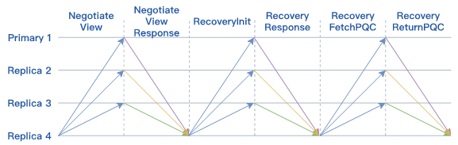

.. role:: math(raw)
   :format: html latex
..

共识机制
============
共识算法是用于保证分布式系统一致性的机制。这里的一致性可以是交易顺序的一致性、账本一致性、节点状态的一致性等。一般地，我们根据容错类型将共识算法分为两类。

-  ``拜占庭容错``: 拜占庭容错强调的是能够容忍部分区块链节点由于硬件错误、网络拥塞或断开以及遭到恶意攻击等情况出现的不可预料的行为。BFT系列算法是典型的拜占庭容错算法，比如PBFT、HotStuff等。
-  ``非拜占庭容错``: 非拜占庭容错通常指能够容忍部分区块链节点出现宕机错误，但不容忍出现不可预料的恶意行为导致的系统故障。常见的CFT共识算法有Paxos、Raft等。

平台采用自适应共识机制，支持RBFT、NoxBFT（BFT类）以及RAFT（CFT类）等多种共识算法，以满足不同的业务场景需求。下文将主要介绍RBFT和NoxBFT两类共识算法。

1. RBFT
---------------
相关变量

在一个由N个节点（N>=4）组成的共识网络中，RBFT最多能容忍f个节点的拜占庭错误，其中：

.. math:: f=[(N- 1)/3]

能够保证达成共识的节点个数为：

.. math:: Quorum=[(N + f +1)/2]

-   常规流程

共识算法RBFT的核心在于保证了区块链各节点以相同的顺序处理来自客户端的交易。下图为最少集群节点数下的共识流程，其中N=4，f=1。图中的Primary1为共识节点动态选举出来的主节点，负责对客户端发来的交易进行排序打包，Replica2，3，4为从节点。所有节点执行交易的逻辑相同并能够在主节点失效时参与新主节点的选举。

|image0|

1)	``交易转发阶段``：客户端Client将交易发送到区块链中的任意节点；Replica节点将接收到的交易广播给所有节点,节点将收到的交易放入交易缓存池；
2)	``Preprepare``：Primary会选择交易缓存池交易进行打包，构造交易哈希的batch；Primary通过batch构造PrePrepare消息广播给其他节点；
3)	``Prepare阶段``：Replica接收来自Primary的PrePrepare消息之后,对batch中的交易哈希进行验证，验证无误后构造Prepare消息发送给其他Replica节点，表明该节点接收到来自主节点的PrePrepare消息并认可主节点的batch排序。
4)	``Commit阶段``：Replica接收到2f个节点的Prepare消息之后对batch的消息进行合法性验证，验证通过之后向其他节点广播Commit消息，表示本节点同意Primary节点的验证结果。
5)	``写入账本``：Replica节点接收到2f+1个Commit之后执行batch中的交易并写入本地账本。

需要注意的是，主节点除负责对交易排序打包外，与从节点功能无异。并且当从节点不认可主节点的排序结果时可以发起相应请求，集齐Quorum个该请求即可切换主节点。

检查点机制

平台设计检查点机制用于对执行结果进行校验。检查点的大小K默认设置为10个区块，节点在写入到K的整数倍个区块后达到一个检查点，广播该检查点的信息对账本一致性进行校验，校验通过后，平台就达到了一个稳定检查点（stable checkpoint）。检查点的大小可按需配置。

交易缓存池

交易缓存池用于共识节点进行交易缓存，一方面可以限制客户端发送交易的频率，另一方面减少了主节点的带宽压力。首先，通过限制交易池的缓存大小，平台可以在交易池达到上限后拒绝接收来自客户端的交易，因此在合理评估机器性能的情况下，可通过合理设置交易缓存大小，从而最大限度地利用机器性能而又不至于出现异常。其次，共识节点在接收到来自客户端的交易后先将其存入本地交易池，随后向全网其他共识节点广播该交易，保证所有共识节点都维护了一份完整的交易列表；主节点在打包后只需要将交易哈希列表放到PrePrepare消息中进行广播即可，而不用将完整的交易列表打包进行广播，从而大大减轻了主节点的出口带宽压力。如果从节点在验证之前发现缺少了某些交易，也只需要向主节点索取缺少的那些交易而不用索取整个区块里面所有的交易。

-   视图更换流程

视图更换（ViewChange）是指因原Primary节点失效而Replica节点参与新Primary节点选举的过程。视图变更能够解决主节点成为拜占庭节点的问题，是保证整个共识算法健壮性的关键。当前可检测到的拜占庭行为有以下情况：

节点停止工作

不再发送任何消息: 这种错误可以通过nullRequest机制保证，行为正确的主节点会在没有交易发生时向所有从节点发送nullRequest表明仍在正常工作，如果从节点在规定时间内没有收到主节点的nullRequest，则会引发ViewChange行为选举新的Primary。

节点发送错误的消息

错误可能是消息内容不正确、包含恶意交易的消息等，需要注意的是，这里的消息类型不仅是batch，也有可能是用于ViewChange的功能性消息。这种错误的解决方案是从节点在接收主节点的消息时，都会对内容进行相应的验证，如果发现主节点的交易包含不符合相应格式的交易或者恶意交易，即验证不通过的时候，会发起ViewChange选举新的Primary。

Viewchange流程如下所示：

|image1|

1)	Replica节点检测到主节点有以上异常情况，向全网广播ViewChange消息；

2)	当新主节点收到Quorum个ViewChange消息时，会发送NewView消息。视图切换成功，新的主节点也切换成功。

-   算法优势

RBFT基于PBFT做了一系列的优化，交易吞吐量可达万级TPS，延迟为毫秒级别。通过新增以下特性大大增强了共识模块的的可用性与稳定性：

-	``动态数据自动恢复机制``：保证网络异常后能快速恢复工作，提升稳定性；
-	``动态节点增删机制``：支持在系统正常运行时动态增删共识节点，提升可扩展性；
-	``共享交易池``：通过预先的交易广播和共享，仅共识交易哈希，降低了主节点的出口带宽。

动态数据失效恢复

区块链网络在运行过程中由于网络抖动、突然断电、磁盘故障等原因，可能会导致部分节点的执行速度落后于大多数节点或者直接宕机。在这种场景下，节点需要能够做到自动恢复并将账本同步到当前区块链的最新账本状态，才能参与后续的交易执行。为了解决这类数据恢复问题，RBFT算法提供了一种动态数据自动恢复机制。

RBFT的自动恢复机制通过主动索取区块和正在共识的区块信息使自身节点的存储尽快和系统中的最新存储状态一致。自动恢复机制大大增强了整个区块链系统的可用性。RBFT为了恢复的方便，对执行的数据设置检查点机制。这样可以确保每个节点检查点之前的数据都是一致的。除了检查点之外，还有部分数据是当前还未共识的本地执行数据。在恢复过程中，首先需要本节点的检查点与区块链其他正在正常服务节点的检查点同步。其次，需要恢复检查点之外的部分数据。

自动恢复机制的基本处理流程如下所示：

|image2|

图中的Replica 4为新启动节点或者其他需要做数据自动恢复的节点，运行中节点为集群中其他正常运行的节点。
Replica 4自动恢复流程如下：

1）  Replica 4 首先广播NegotiateView消息，获取当前其余节点的视图信息；
2）  其余三个节点向Replica 4发送NegotiateViewResponse，返回当前视图信息；
3）  Replica 4 收到Quorum个NegotiateViewResponse消息后，更新本节点的视图；
4）  Replica 4 广播RecoveryInit消息到其余节点，通知其他节点本节点需要进行自动恢复，请求其余节点的检查点信息和最新区块信息；
5）  正常运行节点在收到RecoveryInit消息之后，发送RecoveryResponse，将自身的检查点信息以及最新区块信息返回给Replica 4节点；
6）  Replica 4节点在收到Quorum个RecoveryResponse消息后，开始尝试从这些response中寻找一个全网共识的最高的检查点，随后将自身的状态更新到该检查点；
7）  Replica 4节点向正常运行节点索要检查点之后的PQC数据，最终同步至全网最新的状态。

节点动态增删

在联盟链的场景下，由于联盟的扩展或者某些成员的退出，需要联盟链支持成员的动态治理服务，而传统的PBFT算法不支持节点的动态增删。RBFT为了能够更便捷地管控联盟成员的准入和准出，基于PBFT增加了保持集群非停机情况下动态增删节点的功能。

-   1.新增节点

新增节点流程如下所示（New为新增节点）：

|image3|

1)	首先，新的节点需要获取证书颁发机构颁发的证书，然后向联盟中的所有节点发送NewNode请求；
2)	各个节点确认同意后会向联盟中的其他节点进行全网广播，发送AgreeAdd消息；当一个节点得到Quorum个同意加入的回复后会与新的节点建立连接，随后开始回应新增节点的共识消息请求（在此之前，新增节点的所有共识消息是不予处理的）；
3)	随后，当新的节点和N-f（N为区块链联盟节点总数）个节点建立连接后就可以执行主动恢复算法，同步区块链联盟成员的最新状态。之后向其他节点广播ReadyForN请求；
4)	现有节点在收到ReadyForN请求后，重新计算新增节点加入之后的N,view等信息，随后将其与PQC消息封装到AgreeUpdateN消息中，进行全网广播；
5)	New加入后的共识网络会产生一个新的主节点，该主节点在收到N-f个AgreeUpdateN消息后，以新的主节点的身份发送UpdateN消息；
6)	全网所有节点在收到UpdateN消息之后确认消息的正确性，进行VCReset；
7)	每个节点完成VCReset后，全网广播FinishVcReset消息；
8)	节点在收到N-f个FinishVcReset消息后，处理后续请求，完成新增节点流程。

-   2.删除节点

RBFT节点的动态删除和节点的动态增加流程类似，流程如下所示（Replica5为删除节点）：

|image4|

1)	节点管理员通过调用RPC请求得到删除节点的哈希值，然后发起删除节点请求；
2)	接收到删除请求的节点管理员确认同意该节点退出，然后向全网广播AgreeDel消息，表明自己同意该节点退出整个区块链共识的请求；
3)	当现有节点收到Quorum个AgreeDel消息后，该节点更新连接信息，断开与请求退出的节点间的连接；并在断开连接之后向全网广播AgreeUpdateN消息，表明请求整个系统暂停执行交易的处理行为，为更新整个系统参与共识的N，view做准备；
4)	当节点收到Quorum个AgreeUpdateN消息后，更新节点系统状态，与增加节点步骤5）及之后的流程一样，不再重复。至此，请求退出节点正式退出区块链系统。

.. |image0| image:: ../../images/RBFT1.png
.. |image1| image:: ../../images/viewchange1.png

.. |image4| image:: ../../images/delnode1.png
