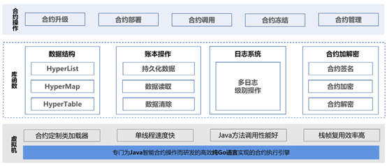
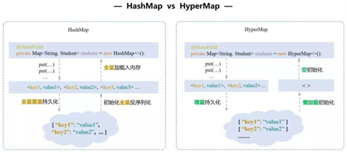
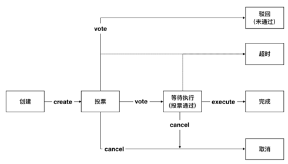

执行引擎
========

执行引擎是一种执行智能合约的安全沙盒环境，在保证合约安全、执行高效的同时，也应具备编程友好的特性。平台支持HVM（HyperVM）、EVM（HyperEVM）、BVM等智能合约引擎，支持Solidity、Java、Go等编程语言，提供完善的合约生命周期管理。

- ``HVM`` (HyperVM)自研支持 Java 语言、完全自主可控的合约执行引擎。支持符合Java编写规范多种数据结构，尤其是内置数据表结构，可以实现业务数据可视化。另外，HVM可在保证智能合约执行的安全性、确定性、可终止性的前提下，提供一系列灵活的应用模式和工具方法集，以满足复杂多样的业务场景需求，面向广泛的区块链开发人员提供更便捷、灵活、安全的区块链应用开发模式。 
- ``EVM`` (HyperEVM)是利用开源社区在智能合约技术和经验方面的积累，为提高智能合约的重用性而深度重构的、支持solidity合约编写的执行引擎。HyperEVM在保持Solidity开发语言的兼容性基础上，对智能合约虚拟机进行性能优化，保持了以太坊虚拟机的沙盒安全模型，做了充分的容错机制，并进行系统级别的优化，结合环境隔离能够保证合约在有限时间内安全执行，在执行性能方面由逼近二进制原生代码的效率。
- ``BVM`` (Built-in VM)是用于处理内置合约的虚拟机类型。BVM的出现让开发者自主定义一些内置合约（即是合约代码由开发人员预先写好，在平台启动时直接创建对象加载，无需用户手动部署），提供用户所需的专属功能。具有性能优良、无需（额外）部署、权限灵活等特性。

HVM
------
1. HVM概述
    由于当前Java语言的流行以及其强大的生态，使用Java语言编写合约无疑会让合约开发更加便捷且易于推广。具体操作上，我们需要给合约提供一个安全沙盒的执行环境不被外界所攻击所打扰，不允许智能合约接触网络、文件系统、进程线程等系统资源，这个安全的沙盒环境我们称之为 **智能合约执行引擎** 。

    平台首创自研支持 Java 语言的智能合约执行引擎 HVM，在保证智能合约执行的安全性、确定性、可终止性的前提下，提供了一系列灵活的应用模式和工具方法集，以满足复杂多样的业务场景需求。

2. HVM使用
    HVM执行机制从外部来看主要负责合约执行的操作。从sdk调用一笔hvm的合约，首先需要共识模块将通过共识的区块交易发送给执行模块，然后执行模块调用HVM暴露出来的合约接口，最后合约执行完成后会将结果返回，将执行结果写入账本中。在架构层面，HVM主要分为三个部分：最底层的虚拟机模块、上层的库函数支持以及最上层的合约操作模块。
    
    - 合约操作层
    
    |image0|
    
    这一层与用户直接相关联，主要包括合约部署、调用等全生命周期管理。
    
    ``合约部署`` ：编写Java智能合约，并通过SDK发交易的形式将其部署到区块链上；

    ``合约调用`` ： 根据合约地址，调用相应合约中的逻辑。

    ``合约升级`` ： 因业务要求或者实现逻辑更新，需要对合约进行升级操作时，需要用新合约来替换掉旧合约，由于升级合约是一个链级操作（改变整个链上的状态），所以需要采用CAF联盟自治框架才可以进行合约升级，保证链上合约的安全控制。

    ``合约冻结/解冻`` ：将链上的合约冻结，在合约所有者解冻之前，禁止任何人调用，冻结不同于销毁，其具备一个可逆的过程，可以通过合约解冻的操作重新使用。

    ``合约销毁`` ：将链上原来部署的合约进行废止操作，不同于合约冻结，合约销毁是一个不可逆的操作，被销毁的合约不能够被访问，不可以恢复，不允许再进行任何操作，但合约销毁后的数据仍然会存在链的底层账本中，仅用于监管审计。
    
    - 库函数层
    
    库函数包括数据结构、账本操作、日志信息以及加解密等功能。
    
    数据结构符合 Java 编写范式：HyperList、HyperMap为平台独立研发，为了方便Java 软件开发者习惯，使其无需感知区块链底层 KV 结构即可编写相应业务逻辑代码。HyperMap 和 HyperList 的使用类似于开发者所熟知的 HashMap 和 ArrayList，但做了原创性地优化，在减少内存使用的同时也提高了更新账本的插入效率。
    
    |image1|
    
    内置数据表结构 HyperTable：为了满足复杂业务场景下数据类型多样化、业务数据可视化与可分析的需求，智能合约需要支持复杂的表结构数据组织形式。HVM 提供了内置数据结构 HyperTable，支持在合约内部按照表的形式组织业务数据，便于业务数据可视化以及后续的数据分析与价值挖掘。这种结构可以让原 Solidity 语言中复杂嵌套的数据操作简单化，同时在性能方面，能有效解决序列化、反序列化造成的性能瓶颈，整体维护成本更低、使用更高效。
    
    |image2|
    
    - 虚拟机层
    
    这一层用户感知较浅，主要是在合约执行过程中，对于合约解析执行的内部操作。为了提高整体的执行效率，HVM设计定制类加载器，类加载缓存提供合约地址到合约类加载器的映射，一个合约类加载器保存合约的字节码和合约类实例，采用最近最少使用淘汰策略（LRU）减少类重复加载带来的开销；指令解析从开始的每次对指令进行解析到将指令做成单例，并进行栈帧复用，大量节省指令执行时间，提高整体执行效率。
    
3. HVM优势
    - 支持多级日志
    
    日志在应用开发过程中的作用至关重要，能帮助开发者快速定位和发现问题。由于 EVM 未对出现的异常进行详细定位，给编译调试造成极大的难度。而 HVM 通过内置日志工具类，支持六种日志级别：critical、error、warning、notice、info、debug。可以为每种常见的错误进行合理的提示，方便使用者对合作操作过程中产生的异常进行debug，方便开发和运维快速定位问题。
    
    - 分层调用模式
    
    HVM采取分层调用的模式，可以有效降低合约升级的成本。其实现方法主要通过InvokeBean的方式在业务调用层在不更新合约的情况下定义丰富的业务逻辑，合约层只实现最核心、最基本的原子操作。以转账场景为例，合约层只有增加余额和减少余额的方法，在InvokeBean调用层定义转账的逻辑：如余额是否充足、减少转让方余额和增加接收方余额。
    
    - 支持加解密工具
    
    一些业务场景需要在智能合约中进行签名验签逻辑处理，从而进行身份认证，便于进行权限判断或者后续业务的开展。因此 HVM 设计了基于 TEE的加解密工具，支持在合约中调用存储于 TEE 的公私钥完成签名、验签操作，并支持 ECDSA国标系列、SM 国密系列等多种加解密算法，具有方便友好安全的特性。
    
    - 支持合约访问控制
    
    合约编码者可以通过智能合约和访问控制策略来限制访问数据的角色和用户，在合约中针对节点、角色、用户定制不同的合约函数访问权限。合约编码者可以在合约中为一些高权限的函数设置权限控制，使得该函数只能被固定地址的调用者调用，从而实现访问权限控制。
    
    - 安全沙盒和计步器机制
    
    HVM 通过安全沙盒模式和计步器机制保证智能合约的确定性和可终止性。确定性是指一段程序在不同的计算机或者在同一台计算机上的不同时刻多次运行，最终执行结果都是一致的。可终止性是指一段程序能在有限时间内结束运行。区块链系统需要保证分布式账本的强一致性，因此执行引擎需要有完善的机制保证最终执行结果的可确定性。HVM 采用安全沙盒模式以及计步器机制保证智能合约的确定性和可终止性。
    
    很多区块链平台采用计时器也即超时机制保证合约的可终止性，但是在分布式系统中，节点的执行时长受限于每个节点自身性能和负载，因此不同的节点往往超时时间并不一样，导致最终执行结果的不一致性，大大降低系统可用性。
    
    HVM 通过资源隔离的方式，即：禁用如 IO 访问、系统调用等不确定的系统操作来保障合约执行环境的安全性。同时通过计步器机制，HVM 的每一步执行指令和资源申请都需要消耗相应的 Gas，使得相同的操作集合最终消耗的 Gas 值一致，从而保证了所有的执行不会受到服务器性能的影响，最终执行结果是确定一致的。

EVM
------

1. EVM概述

HyperEVM是利用开源社区在智能合约技术和经验方面的积累，提高智能合约的重用性而深度重构EVM的虚拟机，并且完全兼容EVM上开发的智能合约。 HyperEVM在保持Solidity开发语言的兼容性基础上，对智能合约虚拟机进行性能优化，保持了以太坊虚拟机的沙盒安全模型，做了充分的容错机制，并进行系统级别的优化，结合环境隔离能够保证合约在有限时间内安全执行，在执行性能方面由逼近二进制原生代码的效率。

2. EVM使用

HyperEVM执行一次交易之后会返回一个执行结果，系统将其保存在被称为交易回执的变量中，之后平台客户端可以根据本次的交易哈希进行交易结果的查询，执行流程如下：

1)	HyperEVM接收到上层传递的交易，并进行初步的验证；
2)	判断交易类型，如果是部署合约则执行3，否则执行4；
3)	HyperEVM新建一个合约账户来存储合约地址以及合约编译之后的代码；
4)	HyperEVM解析交易中的交易参数等信息，并调用其执行引擎执行相应的智能合约字节码；
5)	指令执行完成之后，HyperEVM会判断其是否停机，否的话跳转步骤2，否则执行步骤6;
6)	判断HyperEVM的停机状态是否正常，正常则结束执行，否则执行步骤7；
7)	进行撤回操作，状态回滚到本次交易执行之前。     

3. EVM优势

在合约执行方面，优化执行的内部细节，具体包括优化跳转表的初始化逻辑，然后使得evm创建和执行速度加快；优化了evm初始化上下文的流程，使得context对象可以复用，减少了内存的频繁分配和对象的创建过程，加快了evm初始化速度。同时，支持受众广泛的Solidity合约语言。

BVM
------

1.BVM概述

BVM全称是 **Built-in Virtual Machine** ，是用于处理内置合约的虚拟机类型。BVM的出现可以让开发者可以自定义一些内置合约，提供一些固定的功能。
所谓内置合约，即是合约代码由开发人员预先写好，在平台启动时就直接创建对象加载，不需要用户手动部署的合约。由于合约随着平台预先创建加载， 所以合约地址固定不变，且不属于任何用户，都不可以对该合约进行升级或冻结、解冻的相关操作。

目前BVM支持存证和提案两类内置合约：

- 存证类内置合约 : “SetHash”场景，表示存证场景下文件哈希的存储形式。HashContract中只有两个操作：存和取，对应Set方法和Get方法。

- 提案类内置合约 : 包括更改配置和权限管理等事件，如新增节点投票。提案合约提供创建提案、取消提案、提案投票以及执行提案的操作，分别对应Create、Cancel、Vote、Execute方法。

2.BVM使用

由于内置合约不需要部署，所以会直接抛出合约地址，以供外部调用。提案类操作流程如下：

|image3|

1)	**Create 创建提案** ：区块链普通用户或自治联盟组织成员（区块链的验证节点）链下期望改变区块链的网络状态，首先会编写提案的提案者信息和提案具体内容，随后将提案通过客户端接口向自治联盟组织发送提案请求，最后自治联盟组织系统将事件推送给所有组织成员。在内置的提案合约中，创建的提案可分配置类和权限类。提案创建后，创建者默认为提案的同意者，即创建者默认为对提案投了同意票。
2)	**Vote 提案投票** ：每位组织成员监听到自治联盟组织发来的提案事件，然后定制有利自身的投票策略，每个组织成员根据自定制的策略对收到的提案进行审议分析投票，对提案进行正向或反向投票
3)	**Execute 执行提案** ：当提案的通过票数满足一定限定条件，通过制定的策略进行仲裁。自治联盟组织收到来自各组织成员的投票，判断正向投票数是否达到阈值，确定最后仲裁提案是否被通过，通过后自治联盟组织执行提案内容。
4)	**Cancel 取消提案** ：创建后的提案如果处于投票中、等待执行时，提案创建者可通过Cancel方法取消提案。

3.BVM优势

- 性能优良：由于嵌入系统中，所以可以接近原生代码执行速度。
- 无需部署：无需用户额外部署，可以理解为平台刚启动就被 “部署”在某个固定地址上。
- 权限灵活：不属于任何用户，都不可以对该合约进行升级或冻结、解冻的相关操作。

.. |image2| image:: ../../images/HVM3.png

 
